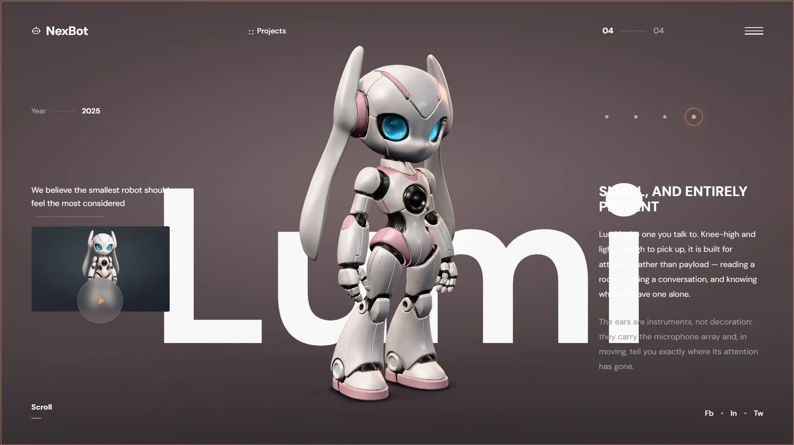

# NexBot — projects

A four-robot showcase built as a single immersive screen: a dark studio, one
oversized word, and a real-time 3D model rendered in front of it. The four
projects are **Kodo** (a wheeled-leg quadruped carrier), **Vero** (a humanoid),
**Nia** (a home helper on a wheeled base) and **Lumi** (a companion).

Three.js draws the robot into a **transparent** canvas that sits above the
page's typography layer, so the model genuinely occludes the word behind it and
its shadow genuinely falls across the letterforms. Nothing about the layering is
faked, and nothing about the model is a pre-rendered image.



*Project 04, Lumi. The word is live DOM type; the robot is a real-time GLB
occluding it.*

## How it was made

The robot designs came off Pinterest. Those images went through **Tripo**, which
turned each one into a 3D model, and **Claude Opus 5** built the site around
them — the render pipeline, the interface and the transitions — so anyone can
turn the models over in a browser rather than looking at a picture of them.

That pipeline is worth stating plainly because it explains most of what follows.
An image-to-3D export is not a hand-authored asset: it arrives as a single mesh
with a single material, roughly two million triangles and 4K atlases, with
lighting and specular highlights baked into the base colour. Everything in
`scripts/` and half the decisions in `src/three/` exist to get that kind of
export onto the web without re-authoring it by hand.

```
npm install
npm run optimize   # source/models/*.glb -> public/models   (output is committed)
npm run media      # public/media/*.png  -> preview WebP     (output is committed)
npm run dev
```

---

## The assets

Four Tripo exports, in `source/models/`. They render beautifully and are
entirely unsuited to the web as delivered — every one of them is around two
million triangles with three 4096² atlases.

| Project | Source | Shipped | Triangles | Textures |
|---|---:|---:|---:|---|
| `kodo` — wheeled-leg quadruped | 12.53 MB | **2.33 MB** | 218,567 | from 1,987,072 tris |
| `vero` — humanoid | 12.12 MB | **2.39 MB** | 214,386 | from 1,949,000 tris |
| `nia` — home helper | 11.70 MB | **2.28 MB** | 217,501 | from 1,977,347 tris |
| `lumi` — companion | 12.08 MB | **2.39 MB** | 216,021 | from 1,963,983 tris |

**48 MB → 9.4 MB**, all four preloaded, with no visible loss. Base colour and
normal drop to 2048, ORM to 1024, all re-encoded as WebP.

Two things drove the pipeline, both from measuring rather than assuming:

- **~2M triangles buys nothing here.** These are smooth hard-surface shells.
  Rendered side by side against untouched geometry, ~215k is where the wheel
  rims and finger joints stop changing. The cost of skipping this step is not
  download size but frame time: a project change has two models live at once,
  and each is drawn for the shadow map, the contact shadow and the beauty pass.
- **The 4K atlases are upscales.** Sampled at 1:1 they are large flat regions of
  soft grey with almost no high-frequency content. 2048 loses nothing on screen
  and turns a 0.9 MB PNG into a 0.25 MB WebP, with GPU residency dropping by
  three quarters.

Geometry ships as `EXT_meshopt_compression` — three bundles the decoder, it
keeps every attribute, and it decodes far faster than Draco on mobile.

The preview cards use cut-outs of the same designs. `scripts/build-media.mjs`
trims each to its true silhouette and pads it onto a transparent 29:18 canvas —
the card frame's own aspect — so every project sits at the same scale and on the
same baseline rather than at whatever crop it was exported with.

Each project's background grade is derived from its own model rather than
picked: the dominant non-grey albedo is sampled out of the GLB's textures and
held at the lightness of the base slate, so the room changes colour with the
robot standing in it while contrast against the copy stays where it was.

---

## Architecture

```
src/
├─ App.jsx                 project state, and the master transition timeline
├─ data/vehicles.js        copy, framing, grade and presentation, per project
├─ components/             the interface — no component knows which model it draws
├─ lib/
│  ├─ motion.js            one easing and duration vocabulary for DOM and WebGL
│  └─ transitions.js       the interface half of a project change
└─ three/
   ├─ Experience.js        renderer, loop, lifecycle — entirely outside React
   ├─ CameraRig.js         product-photography framing, derived from measured bounds
   ├─ VehicleManager.js    load, normalise, condition, cache
   ├─ StudioEnvironment.js a hand-built lighting studio, pre-filtered to an env map
   ├─ Lighting.js          key / fill / kicker, and the only cast shadow
   ├─ ContactShadow.js     the model rendered from underneath, blurred, projected
   ├─ PostFX.js            an alpha-preserving bloom and tone-mapping chain
   ├─ RotationController.js turntable drag with momentum
   └─ quality.js           device tiering, and a governor that steps down on demand
```

React owns the interface; `Experience` owns the frame. The only traffic between
them is a project index going in and a few lifecycle callbacks coming out — so
nothing in the 3D layer ever triggers a re-render, and no re-render ever costs a
frame.

---

## Decisions worth knowing about

**A custom post chain, not `EffectComposer`.** three's composer assumes it owns
an opaque frame. This one carries alpha end to end, which is what lets the canvas
float over the page. Tone mapping (Khronos PBR Neutral, built for product
visualisation) runs in the final pass, because three skips tone mapping entirely
when a scene renders into a render target.

**A built studio, not an HDRI.** A stock environment announces itself the moment
the model turns — you read a room in the paint. `StudioEnvironment` models what a
product shoot actually looks like: one big soft key, a broad low fill, a long
overhead strip that draws the highlight down the body, and a warm kicker behind
the shoulder. Because it is geometry, the reflections are art-directed rather
than inherited.

**Materials are conditioned, not replaced — and currently not at all.**
`MATERIAL_CONFIG` in `VehicleManager.js` can lift baked light strips into an
emissive channel they were exported without, and can raise a roughness floor
where a map bottoms out near zero and turns panels into mirrors. Both are shader
patches rather than material replacements, so everything the asset authored
survives. The table is empty today: these four exports ship real ORM and normal
maps and need neither. It is deliberately empty rather than inherited — a
threshold tuned to one export's baked light strip will lift another's white
panel into emission, so an entry is added only once a model is measured to need
one.

**Framing is measured, never hard-coded.** Every model is scaled on its longest
authored axis, re-centred on its own footprint and dropped onto the floor,
whatever the exporter left behind. The camera then fits it using extents that are
invariant under yaw, so the model holds its size as it spins instead of
breathing. How much width it may claim comes from the live gap between the left
rail and the right column — which is why it can never grow into the copy at any
viewport, and why the 3D layer asks the interface whether the rails are still
beside the hero rather than inferring it from the viewport.

**Stacking is decided by aspect, not width alone.** A 900×620 window is narrow
enough to hit the mobile breakpoint and wide enough to host the side-rail
composition; stacking it would bury the model under the content sheet. The
layout collapses below 13/10 and keeps its rails above it.

**Fading an opaque mesh needs a depth prepass.** Turning on `transparent` alone
is what makes a single-mesh model appear to break apart mid-transition: with
depth writes off you look straight through the shell to the parts behind it, and
with them on the far side blends in underneath the near one. Each model
therefore gets a colour-less clone that lays down depth first, so only the
nearest surface ever blends. Geometry is shared, so it costs one depth-only pass
while a transition runs and no extra memory at all.

**Both program variants are compiled before a model is ever shown.**
`transparent` is part of three's program cache key, so the first dissolve would
otherwise compile a second shader mid-transition — a hitch landing exactly when
the eye is on the model. `load()` compiles both and calls `initTexture` on every
map, so a model's first visible frame is never drawn against three's 1×1 white
placeholder.

**Two shadows, one handle.** A shadow map alone leaves the model pasted onto the
floor. `ContactShadow` renders it from directly underneath, weights each fragment
by its distance to the ground and projects the blurred result back down, so the
feet and wheels get a contact patch. Both shadows move together through a single
`shadowStrength` — a shadow map is drawn from depth, so a model faded to zero
opacity still casts one, and a project change would otherwise leave a silhouette
hanging over an empty floor.

**Shadows are re-drawn only when the model has actually moved.** Idle drift falls
under the threshold, so a resting hero costs one pass a frame instead of three.

**One master timeline per project change.** The model, the word behind it and
every line of copy are children of the same clock. The interface swaps at the
midpoint under `flushSync`, so the entrance tween never animates stale text. Two
choreographies alternate on every change — one arrives out of depth, the other
swings in from the side — so scrolling through the work never plays the same
entrance twice in a row.

**A wheel is not one input.** A notched mouse sends a handful of large deltas, a
trackpad sends a continuous stream of small ones and keeps sending them as
momentum after the fingers have lifted, and Firefox reports lines rather than
pixels. All three are normalised to pixels and resolved against a gesture gap
rather than a fixed cooldown, and a flick made during a transition is queued
rather than dropped — swallowing input for the second a change takes is what
reads as lag.

---

## Verification

`tools/capture.mjs` boots Vite in-process, drives a real Chrome over it and
writes a screenshot per entry in `tools/shots.json`, asserting no horizontal
overflow, no page errors and no failed requests along the way.

```
node tools/capture.mjs                       # the full matrix
node tools/perf.mjs                          # draw calls, triangles, retention
node tools/timeline.mjs nia                  # frames at fixed offsets after load
TIME_SCALE=0.1 node tools/burst.mjs kodo 3   # a project change, frame by frame
```

The last two exist because a settled screenshot cannot show a transition. Both
lean on `window.__experience` and `window.__gsap`, which are exposed in
development only; `TIME_SCALE` slows every timeline so headless screenshot
latency cannot outrun the moment being inspected.

`perf.mjs` also cycles every project three times and reports whether geometry or
texture counts grow — they do not, past the one-time GPU residency of the models
loaded along the way.

Set `CHROME` to point either harness at a specific browser. Both disable
headless Chrome's background throttling: left on, it drops `requestAnimationFrame`
to a few frames a second, the boot sequence never finishes, and every screenshot
looks like a bug in the app rather than in the harness.

---

## Known constraints

- The models are image-to-3D exports and are treated as the source of truth.
  Where a bake carries its own lighting, or geometry the design would not have,
  it is left alone rather than re-authored.
- Secondary copy sits at ~3.7:1 rather than the 4.5:1 WCAG asks for. This is a
  deliberate midpoint between the art direction and legibility, and every value
  a user needs is also exposed to assistive technology through labels.
